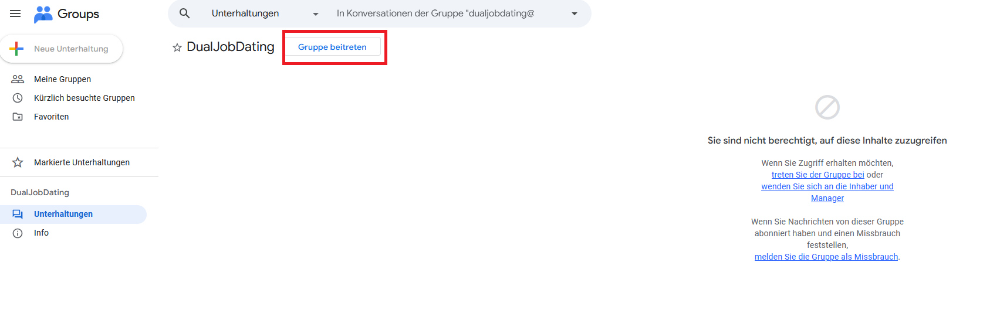
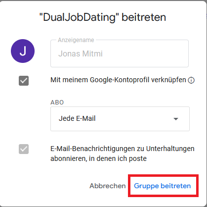
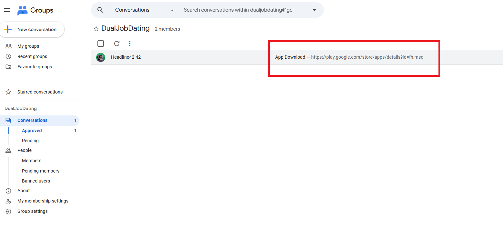

# So bekommst du die App

Die App wird über Google Play als geschlossener Test verteilt. Du brauchst ein Google-Konto und musst alle Schritte mit demselben Konto durchführen.

> Verwende dasselbe Google-Konto für die Gruppe und den Play Store. Wenn sie nicht übereinstimmen, bekommst du auf der Store-Seite keinen Zugriff.

---

## Schritt 1 - Google Group beitreten

Öffne den Google-Group-Link, den du vom Veranstalter erhalten hast. Stelle sicher, dass du mit deinem Google-Konto eingeloggt bist, und klicke auf **Gruppe beitreten**.

---

## Schritt 2 - Bestätigen

Es erscheint ein Dialog mit deinem Anzeigenamen und Abo-Einstellungen. Klicke auf **Gruppe beitreten** um zu bestätigen.

---

## Schritt 3 - App installieren

Sobald du Mitglied bist, öffne den **App Download** Beitrag in der Gruppe und klicke auf den Play-Store-Link.

Falls auf der Play-Store-Seite **Am Testprogramm teilnehmen** erscheint, klicke darauf. Anschließend auf **Installieren** klicken.

